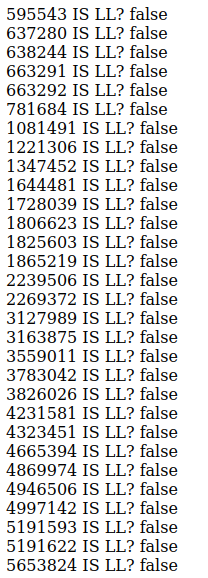

# llegend
WiP, but goal is:
  - shows segments you are local legend of on a map
  - color coding of the segment showing how close to being overtaken
  - color red = someone is nearly passed efforts
  - color green = many efforts before someone catches you
  - color gray = lost LL
  - later: show segments you are getting close to being LL for with similar color coding

## building and running
There are three necessary environment variables to run. The first is the access
token for the strava API, the second is the athlete ID, the third is the google maps API key.
```
ACCESS_TOKEN=
ATHLETE=
GMAPS=
```

You can get a strava API token by creating an app here: https://www.strava.com/settings/api
And you get the athlete id from your strave profile page (its at the end of the URL)

These can be set via `.env` file for docker and docker-compose, otherwise
they can be passed in via the command to run the program:

### locally
```
go build
ACCESS_TOKEN=<insert> ATHLETE=<insert> ./llegend 
```

### docker
```
docker build -f Dockerfile . -t llegend
docker run -p 8080:8080 --env-file .env llegend
```

### docker-compose
`docker-compose up --build`

Then browse to http://localhost:8080

## What works
- Can get starred segments for the user and determine whether or not local legend



## Todo

- Add map data for segment to data structure we return to template
- Integrate some type of map API
- Plot segments on map

- For segments which we are LL for:
  - Determine our current efforts in past 90 days from histogram
  - Determine next nearest total from past 90 days from histogram
  - Add difference score to data structure we return to template
  - Plot map with colors corresponding to difference score

- For segments which we are not LL for:
  - Determine our current efforts in past 90 days from results
  - Determine the current leaders 90 day effort
  - Determine difference score
  - Plot map with colors corresponding to difference score
    - distinguish between those we are LL of and those we could become

- Create periodic task to refresh data
- Notify via email or something if about to lose LL
- Tests
- Spruce up the UI

## inspiration projects
http://www.raceleap.live/
https://stravanity.vercel.app/
